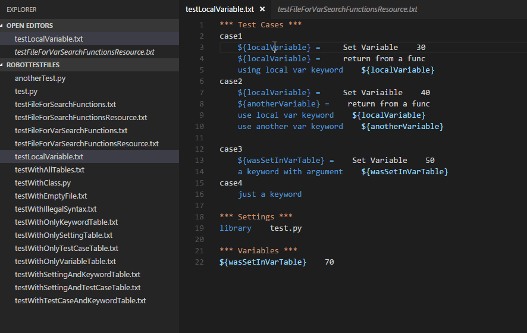

## Features
1. Gramma highlight
2. User defined keyword Goto definition

3. User defined library Goto definition

4. User defined variable Goto definition

5. Variable scope support, if a variable is defined dynamically in test case(through Set Variable keyword or some libaray function return value), and it will goto the right place


## Requirements
User define system environment variable *PY_SITE_PATH*, which indicate the site package path, for example, if your python site package is located in C:\Python27\Lib\Site-Packages.

You can make the *PY_SITE_PATH* variable to this value.  (This environment variable is needed because if your keyword is defined by python, it will search into this site package and find it's definition.)


## Extension Settings
None

## Release Notes

### 0.1.0
Some function include read file is implemented in sync way, so there may have be blocked if you using goto definition in a very big test case file or a resource file.  These functions may be fixed to active async way in later version.

### 0.2.1
Support goto variable definietion

### 0.2.7
Support variable scrope analyze

### 0.2.8
Fix error file suffix support format, for now support .robot file but not .txt file

```
test code
```

not existed.
