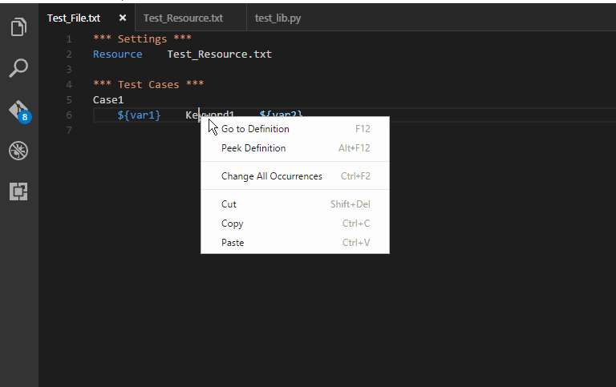
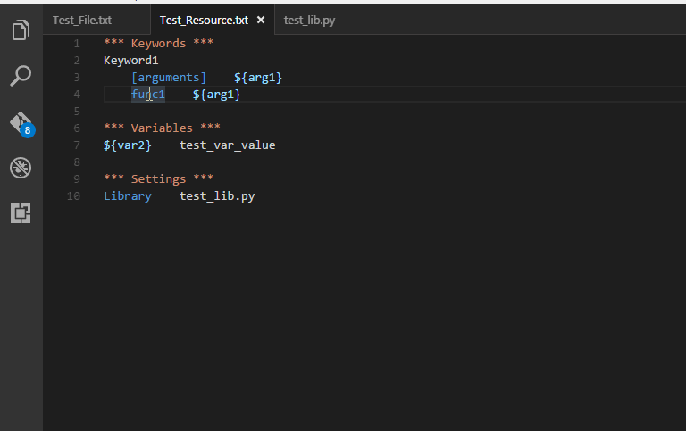
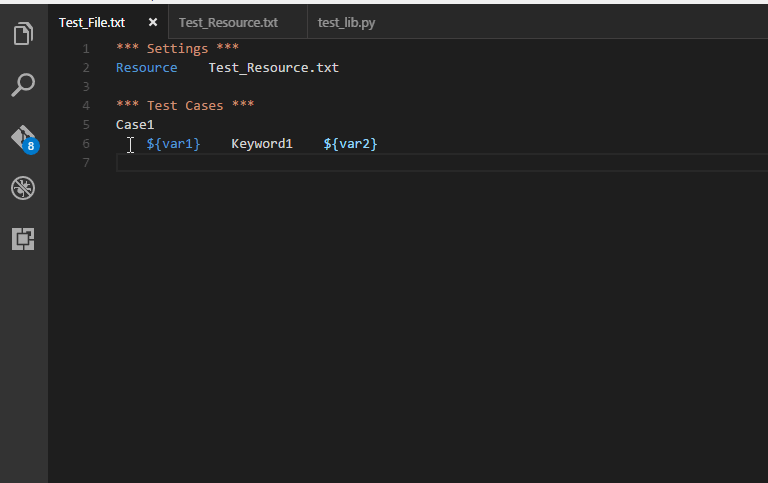

## Features
1. Gramma highlight
2. User defined keyword Goto definition

3. User defined library Goto definition

4. User defined variable Goto definition

## Requirements
User define system environment variable *PY_SITE_PATH*, which indicate the site package path, for example, if your python site package is located in C:\Python27\Lib\Site-Packages.  

You can make the *PY_SITE_PATH* variable to this value.  (This environment variable is needed because if your keyword is defined by python, it will search into this site package and find it's definition.)

## Extension Settings
None

## Known Issues

### Issue 1
Because robot framework support txt file, for this reason, if you are using robot file with txt extension, you should change the language to robot manually, it is recommended to add vscode setting to robot folder.  For example, if you have a folder named TestSuiteDirectory, which contains test suite files.  Then you can create .vscode folder in TestSuiteDirectory, and create settings.json file, add something like this:

    // Place your settings in this file to overwrite default and user settings.
    {
        "files.associations": {
            "*.txt": "robot"
        }
    }

### Issue 2
The gramma don't support highlight robot builtin keyword yet.

## Release Notes

### 0.1.0
Some function include read file is implemented in sync way, so there may have be blocked if you using goto definition in a very big test case file or a resource file.  These functions may be fixed to active async way in later version.